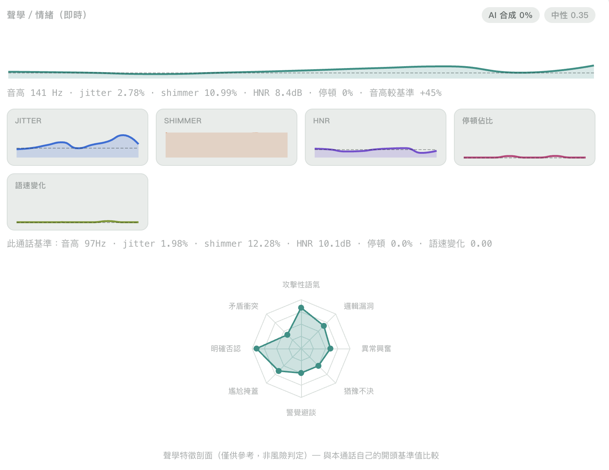
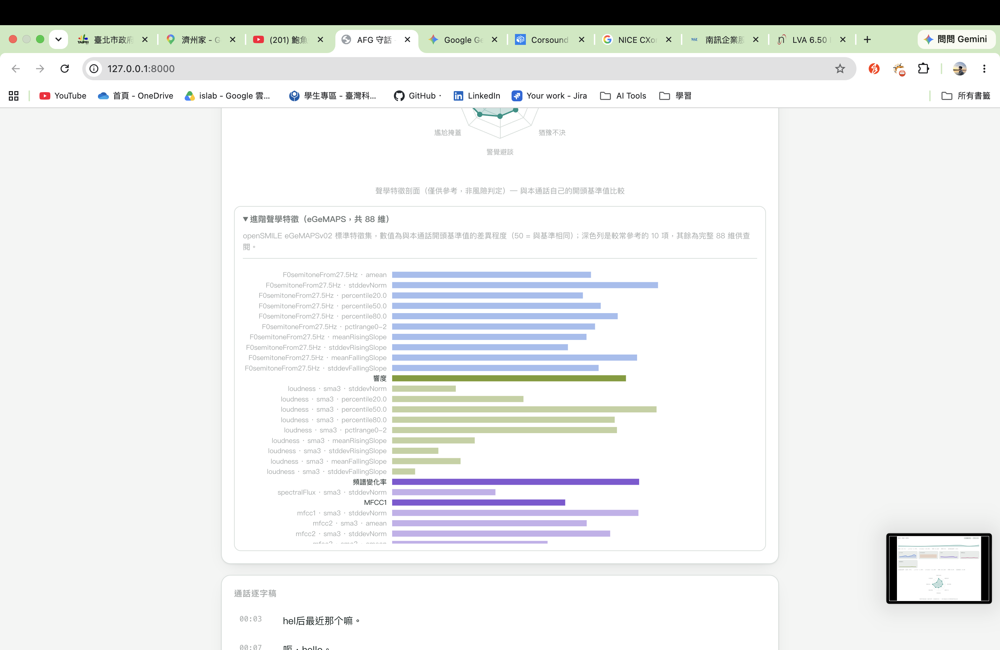

# AFG 守話 — 即時通話防詐

即時分析電話通話音訊、偵測詐騙手法並在通話中示警的工具。目前版本是 `antifraud_v3/`，
上一版 `antifraud_v2`（Streamlit、事後分析整通電話）已刪除，可從 git commit `0c66823` 找回。

## 如何使用這個專案

1. **安裝環境**——跑一次性的 setup 腳本（會建立/沿用 conda 環境、處理 fairseq 的 pip 版本相容性問題、
   裝好 `antifraud_v3/requirements.txt` 全部套件、建立 `.env`，並檢查系統套件/GPU/`claude` CLI 是否
   齊全）：
   ```bash
   bash antifraud_v3/setup.sh
   ```
   腳本本身不會自動裝系統套件（ffmpeg/libsndfile1）或 `claude` CLI，只會提醒缺什麼、該怎麼裝——這些
   通常需要 `sudo`，交給你自己決定要不要裝。可以重複執行，每個步驟都是 idempotent 的。

   等同於手動跑：
   ```bash
   conda create -n AFG python=3.10   # 或用你自己的 venv
   conda activate AFG
   pip install "pip==24.0"           # fairseq==0.12.2 的 PyPI 中繼資料需要舊版 pip 才能解析
   pip install -r antifraud_v3/requirements.txt
   pip install --upgrade pip         # 裝完再換回新版，不影響已裝套件
   cp antifraud_v3/.env.example antifraud_v3/.env
   ```
2. **設定 LLM**（`.env` 已經在步驟 1 建立好了，這裡只是說明預設行為）——
   預設 `LLM_PROVIDER=claude_code`，不用填任何金鑰——只要這台機器的 `claude` CLI 是登入狀態
   （跑 `claude auth status` 確認 `authMethod: "claude.ai"`），就會走你的 Claude Pro/Max 訂閱額度，
   不是按 token 計費的 API。如果你有獨立的 API 金鑰想用，見下方「LLM 認證細節」。
3. **啟動伺服器**
   ```bash
   cd /home/tommy/Project/AFG
   uvicorn antifraud_v3.server.main:app --reload
   ```
4. **打開瀏覽器**：連到 `http://localhost:8000`，允許麥克風權限，按「開始監聽」即時分析通話；
   或用「上傳錄音分析」分頁分析事後錄好的錄音；「測試資料」分頁可以直接跑內建的範例音檔看效果。
5. **（選用）在手機瀏覽器上用**：瀏覽器只有在 `https://` 或 `http://localhost` 底下才會允許存取
   麥克風，用手機連到區網/公網上另一台機器的 `http://` 網址不會跳出權限請求，需要另外跑 HTTPS——
   完整步驟見 [`antifraud_v3/docs/HTTPS.md`](antifraud_v3/docs/HTTPS.md)。

**LLM 認證細節**：如果你有獨立的、有額度的 API 金鑰，可以切回原本直接呼叫 API 的路徑：把
`antifraud_v3/.env` 的 `LLM_PROVIDER` 改成 `claude`，並填 `ANTHROPIC_API_KEY`（或安裝
[`ant` CLI](https://github.com/anthropics/anthropic-cli) 跑 `ant auth login`）。這兩個設定
在前端「設定」畫面也可以直接切換，不用改檔案重開伺服器。

**Line 2／ASR／情緒辨識後端可選**：前端「設定」畫面可以切換話術詐騙判定（Line 2）、語音辨識
（ASR）、情緒辨識的後端，不需要額外安裝步驟（`setup.sh`／`requirements.txt` 已經涵蓋）：
- **Line 2**：`claude`（預設，沿用上面的推理提供者/模型，純文字判定，不佔 GPU，速度較快）或
  `qwen2audio`（本機 AntiFraud-SFT 音訊模型，較慢但不需要 LLM 額度，見下方架構說明）。
- **ASR**：`whisper`（預設）或 `sensevoice`（FunASR SenseVoiceSmall）。第一次選 sensevoice 會現場
  下載約 936MB 的模型權重（快取到 `~/.cache/modelscope`），之後就不用重新下載。
- **情緒辨識**：`wavlm`（預設，WavLM-large 微調，見下方模型清單）或 `timnet`（原本的模型，保留作
  比較/備用）。第一次選 wavlm 會現場下載 `microsoft/wavlm-large` 骨幹（約 1.2GB）+ 微調權重
  （快取到 `~/.cache/huggingface`），之後不用重新下載。
- **LLM 最終研判文字**：預設**關閉**——風險等級/詐騙類型判定完全由 Line 1/Line 2 的 fusion 結果決定
  （見下方），跟這個開關無關；關閉時「最終研判」的說明文字改用固定模板，不呼叫 LLM，開啟後才會多花
  一次 LLM 呼叫產生真正的自然語言說明。

## 這個專案怎麼分析一通電話

一句話講完（VAD 偵測到停頓）就立刻跑聲學/語音/情緒/AI合成語音偵測，即時顯示；話術詐騙判定跟風險
判定則是整通電話結束後才各跑一次。

### 用了哪些模型、抓出什麼特徵

| 環節 | 模型/方法 | 產出的特徵/結果 |
|---|---|---|
| VAD 切句 | silero-vad | 「一句話講完」的切點（不是固定秒數硬切） |
| 語音辨識 ASR | faster-whisper（預設）／SenseVoiceSmall（FunASR，可選） | 逐字稿 |
| 傳統聲學特徵 | parselmouth／librosa（手刻） | 音高、音量、jitter/shimmer/HNR（聲音顫抖度）、語速與停頓變化——即時算出並畫成折線圖 |
| 進階聲學特徵 | **openSMILE eGeMAPSv02** | 業界標準的 88 維聲學功能集（響度、共振峰 F1-F3、MFCC、頻譜斜率/變化率、Hammarberg 指數等）——目前**純顯示用**，還沒接進風險判定，見下方「已知還沒做的」 |
| 情緒辨識 | **WavLM-large 微調**（[tiantiaf/wavlm-large-categorical-emotion](https://huggingface.co/tiantiaf/wavlm-large-categorical-emotion)，預設）／TIMNet（可選） | 9 類情緒（生氣/輕蔑/厭惡/恐懼/開心/中性/難過/驚訝/其他）+ 激動度/情緒正負/主導性；WavLM 版本經 INTERSPEECH 2025 情緒辨識競賽（SAILER 系統）驗證過，都當輔助證據，不是硬性門檻 |
| **Line 1：AI 合成/複製語音偵測** | [nii-yamagishilab/xls-r-2b-anti-deepfake](https://huggingface.co/nii-yamagishilab/xls-r-2b-anti-deepfake)（XLS-R 2B） | 每句話的「AI 合成機率」連續分數（0-100%），不是跳出警告，超過門檻會直接讓 fusion 判定高風險 |
| **Line 2：話術詐騙偵測** | `claude`（文字語意，預設）／[JimmyMa99/AntiFraud-SFT](https://huggingface.co/JimmyMa99/AntiFraud-SFT)（Qwen2-Audio-7B 微調，可選） | 是否為詐騙話術 + 詐騙類型（銀行詐騙/投資詐騙/假冒公務機關等 7 類，TeleAntiFraud-28k 分類法） |
| 關鍵字立即示警 | 純字串比對，不用模型 | 通話進行中命中「要求驗證碼」「要求轉帳」等關鍵字立刻示警，是通話還在進行時唯一即時的示警來源 |
| 風險判定 | **Line 1 + Line 2 兩線 fusion**（`reasoning/fusion.py`） | 風險等級（低/中/高）+ 詐騙類型——不靠 LLM，兩個獨立偵測訊號說了算 |
| 最終研判文字 | Claude（判別→反思→綜合三步驟，**預設關閉**） | 一段自然語言說明；關閉時改用固定模板文字，不呼叫 LLM。「反思」步驟專門找「這個證據有沒有無辜的解釋」，避免把正常對話誤判成詐騙 |

### 最後拿到什麼樣的分析結果

即時通話／上傳錄音／測試資料三個畫面共用同一套呈現（[ECharts](https://echarts.apache.org/) 繪圖，
自己 host 不吃外部 CDN）：

- **風險儀表**——0-100 分的風險分數，低/中/高風險三色圓弧。
- **AI 合成語音分數**——連續百分比小標籤，跟情緒標籤並排即時更新，不是跳出來的警告視窗。
- **聲學小圖表**——音高／Jitter／Shimmer／HNR／停頓佔比／語速變化，各自不同顏色的折線圖，虛線
  標出這通電話自己的開頭基準值。
- **8 軸聲學剖面雷達圖**——攻擊性語氣、矛盾衝突、猶豫不決等 8 個敘事化軸向，每軸對應一項聲學指標
  跟這通電話自己基準值的偏離程度（僅供參考，不是風險判定的一部分）。

  

- **進階聲學特徵（eGeMAPS，88 維）**——預設收合、固定高度可捲動的長條圖，深色列是 10 項比較常
  參考的特徵，其餘 78 項一起列出，顏色依特徵類別（音高/響度/共振峰/聲音品質/頻譜）分組。

  

- **逐字稿**——命中示警關鍵字/詐騙話術的句子會反白標出。
- **示警／最終研判**——顯示 fusion 判定出的風險等級、詐騙類型，以及對應的說明文字。
- **歷史紀錄**——每通電話（含上傳分析）都存進 SQLite，可以刪單筆或刪全部。

完整設計脈絡與為什麼這樣分工（即時 vs. 事後一次）見下方「架構」與 `antifraud_v3/docs/DESIGN.md`。

## 為什麼重寫

`antifraud_v2` 的 `fraud_detection.py` 用「逐一指標加總門檻分數」的規則引擎判斷風險，這個設計
本身有結構性問題：正規化公式只用「有觸發」的指標權重當分母，導致單一微弱、常見的訊號（例如講話
語氣平靜）就能把某個詐騙模式的分數推到接近滿分，跟其他指標有沒有觸發無關。這正是「隨便講一句話
就被判定高風險」的根本原因——不是門檻數字設得不好，是這個公式的形狀本身就有問題，調數字沒有用。

`antifraud_v3` 一開始用 LLM 推理（判別 → 反思 → 綜合三步驟）取代這個規則引擎，並把架構從「上傳整通
電話事後分析」改成「通話中即時分析、即時示警」。後續又把風險判定本身從 LLM 換成兩個獨立音訊偵測
模型（AI 合成語音 + 話術詐騙）的 fusion 結果（見下方「架構」），LLM 現在只負責（可選地）把已經
決定好的判定寫成說明文字，不參與判定本身——同樣是為了不讓單一環節（不管是規則引擎的加總公式，還是
LLM 的主觀判斷）獨自決定「這通電話是不是詐騙」。完整設計脈絡與決策理由見 `antifraud_v3/docs/DESIGN.md`。

## 架構

```
瀏覽器麥克風
  └─ AudioWorklet 擷取音訊 ──WebSocket──▶ FastAPI 後端
                                            │
                                     VAD 切句（silero-vad）
                                            │
                ┌──────────┬──────────┬──────────┬───────────┬──────────┐
              語音辨識   傳統聲學特徵  eGeMAPS   情緒辨識   Line 1：AI合成語音    ← 每句話即時跑，
           (faster-whisper) (parselmouth) (openSMILE) (WavLM/TIMNet) (XLS-R-2B)     不用 LLM，
                └──────────┴──────────┴──────────┴───────────┴──────────┘        即時推送到前端
                                            │ （同時：關鍵字比對，命中立即示警，不用 LLM）
                                            │
                              …（通話進行中持續累積逐字稿／各項訊號）…
                                            │
                                      「結束監聽」
                                            │
                           Line 2：話術詐騙偵測（claude 文字語意 / Qwen2Audio）  ← 整通電話只跑這一次
                                            │
                        Line 1 + Line 2 兩線 fusion → 風險等級 + 詐騙類型      ← 不靠 LLM，見
                                            │                                  reasoning/fusion.py
                            （可選）LLM 判別→反思→綜合，寫最終研判說明文字      ← 預設關閉，只影響
                        （claude_code：Claude Pro/Max 訂閱額度，                  文字，不影響上面
                          或 claude：anthropic API，可插拔 provider 介面）        已定的風險判定
                                            │
                              最終研判 + 示警 ──WebSocket──▶ 前端即時畫面
                                            │
                                  SQLite 通話紀錄／JSON 設定
```

- **不用固定秒數切句，用 VAD 偵測「一句話講完」**——這樣聲學特徵、情緒模型、Line 1 偵測才是對著完整
  語句分析，不是隨機切到一半。
- **風險判定是兩線 fusion，不是 LLM，也不是規則引擎**——`reasoning/fusion.py` 的 `fuse()`：Line 1
  （AI 合成語音分數超過門檻）優先判定高風險；否則看 Line 2（話術詐騙偵測）的結果；兩者都沒觸發才是
  正常通話。LLM（如果開啟）只負責把這個已經決定好的判定寫成自然語言說明，**不會**推翻或改變風險
  等級/詐騙類型本身——這是刻意的設計，避免「LLM 講的跟畫面上的風險燈號兜不起來」。
- **聲學／語音辨識／情緒／Line 1 是即時的，Line 2 跟（可選的）LLM 說明文字只在通話結束後各跑一次**
  ——原本每句話都跑一次 `discriminate → reflect → synthesize`，對沒有付費 API 額度來說成本太高；
  現在通話中即時串流的都是本地模型（不用 LLM、不用網路），Line 2 跟最終研判文字在「結束監聽」後對
  整通逐字稿/音訊跑一次，見 `antifraud_v3/pipeline/chunk_worker.py` 的 `run_final_analysis`。
- **「立即示警」關鍵字比對是通話進行中即時跑的**（要求驗證碼、要求轉帳等，純字串比對、不用 LLM，見
  `pipeline/call_state.py` 的 `check_live_hard_trigger`）——這是通話還在進行中時唯一即時的示警來源，
  因為 Line 2 跟最終研判說明都被延後到通話結束才跑。
- **LLM 供應商可插拔**——`llm/base.py` 定義介面。預設是 `llm/claude_code_provider.py`（呼叫
  `claude` CLI，走 Claude Pro/Max 訂閱額度，不用按 token 付費的 API 金鑰）；`llm/claude_provider.py`
  是原本直接呼叫 anthropic API 的實作，有獨立 API 金鑰的話還是可以用。換供應商只需要新增一個
  class，不用動推理邏輯本身。
- **情緒辨識（WavLM/TIMNet）刻意當弱訊號用**，不是硬性門檻，不影響風險判定——WavLM 版本訓練資料
  是英語 podcast 語料（MSP-Podcast），TIMNet 版本是英/德/義等語言的表演式情緒語料，都不是中文電話
  對話，所以只當展示用的輔助資訊，不餵進 fusion 或 LLM 判定。
- **eGeMAPS（88 維進階聲學特徵）目前也是純展示，不影響風險判定**——跟情緒辨識一樣，UI 上看得到、
  可以查閱，但還沒接進 `fuse()` 的判定邏輯，見「已知還沒做的」。
- **除了即時監聽，也可以上傳事後錄好的通話錄音分析**（`POST /api/upload-call`，前端「上傳錄音分析」
  分頁）——跑一樣的 VAD 切句 + 逐句訊號擷取 + 一次最終分析，差別只在於同步跑完整段錄音、一次回傳結果，
  而不是像即時通話一樣用 WebSocket 逐句推送（批次分析不像即時監聽那樣對延遲敏感，見
  `antifraud_v3/server/upload.py` 開頭的說明）。結果一樣會存進歷史紀錄，用 `source` 欄位跟即時通話
  區分開來。

## 專案結構

```
antifraud_v3/
├── audio/          VAD 切句、傳統聲學特徵擷取（parselmouth/librosa）、eGeMAPS（openSMILE）、
│                   TIMNet 情緒推論、MFCC
├── asr/            faster-whisper／SenseVoiceSmall 語音辨識（可切換後端）
├── detectors/       本機 ML 偵測模型的載入/推論：Line 1 AI合成語音（XLS-R-2B）、
│                   Line 2 話術詐騙（Qwen2Audio）、WavLM 情緒辨識——跟 audio/ 的差別見
│                   config.py 開頭的說明
├── llm/            可插拔 LLM 供應商介面 + Claude 實作
├── reasoning/       fusion.py（Line1+Line2 風險判定，不靠 LLM）+ 判別/反思/綜合推理引擎
│                   （可選的最終研判說明文字）、詐騙話術 rubric、Pydantic schema
├── pipeline/        逐句訊號擷取 + 整通電話一次性最終分析、通話狀態機（逐字稿、示警狀態）
├── server/          FastAPI app、WebSocket 即時端點、REST API（歷史紀錄／設定／上傳分析）
├── storage/         SQLite 通話歷史、JSON 設定檔存取
├── frontend/        即時通話／上傳分析／歷史紀錄／測試資料／設定五個畫面（純 HTML/CSS/JS +
│                   自己 host 的 ECharts，無其他框架）
├── models/          TIMNet／XLS-R-2B／WavLM 情緒模型的架構定義檔 + TIMNet 訓練好的權重
├── eval/            沒有標註資料集時的自我測試框架（regression log + 真人語音測試集）
├── tests/           pytest 單元測試（見下方「測試」一節）
└── docs/            DESIGN.md（完整設計決策記錄）、HTTPS.md（手機瀏覽器連線設定）
```

## 測試

**自動化測試**（`antifraud_v3/tests/`）：

```bash
cd /home/tommy/Project/AFG
pytest                        # 完整套件，包含會打真的 Claude API 的 live_api 測試
pytest -m "not live_api"      # 只跑快速、不用網路的單元測試（CI/沒有 API 額度時用這個）
```

大部分測試用一個假的 `LLMProvider`（`tests/conftest.py` 的 `FakeLLMProvider`）跟暫存的
DB／設定檔路徑，不會碰到真正的 API 額度或 `antifraud_v3/data/` 底下的正式資料。少數標了
`@pytest.mark.live_api` 的測試會真的呼叫 Claude API，當作跟真實模型行為對齊的 smoke test。

**手動/端對端驗證**：已用真實中文語音（`edge-tts` 生成，`eval/test_clips/` 底下 scam/benign 各
10 段，涵蓋銀行/公務機關假冒、投資詐騙、假綁架等多種話術，以及冷靜語氣、慢語速、跟詐騙無關的抱怨
等已知容易誤判的正常對話情境）+ headless 瀏覽器（Playwright，模擬麥克風輸入／檔案上傳）跑過完整
流程，確認麥克風擷取、VAD 切句、語音辨識、聲學特徵、LLM 推理到示警全部串接正確。跑
`python -m antifraud_v3.eval.run_test_set` 會把每段測試音檔的判斷結果記錄到
`eval/regression_log.jsonl`，改動 prompt/rubric 後可以快速比對有沒有退步。

**已知還沒做的**：
- 語者分離——目前分不出通話中「誰在講話」，聲學/情緒特徵是整段混合訊號的統計量。
- eGeMAPS（88 維進階聲學特徵）目前純顯示用，還沒實際拿來訓練/接進風險判定——`eval/test_clips`
  目前全部是 TTS 合成語音，拿來訓練分類器學到的會是「唸詐騙腳本」跟「唸正常腳本」的差異，不是真人
  聲音的緊張/欺騙線索，需要真人語音樣本才有意義。
- Line 1（AI 合成語音偵測）的判定門檻沒有校準過——沒有真人（非 TTS）的真/假語音樣本可以拿來調
  `DEEPFAKE_FAKE_SCORE_THRESHOLD`，目前的門檻是模型作者建議值，不是針對這個場景測出來的。
- 歷史紀錄/設定畫面沒有帳號或多裝置同步機制，單機本地使用。
- 上傳分析目前只吃 `soundfile`（libsndfile）能直接解碼的格式（wav/flac/ogg）——手機錄音常見的
  m4a/mp3 需要先用 ffmpeg 轉檔，見 `server/upload.py` 的錯誤訊息。

**上傳電話品質（窄頻）錄音**：`server/upload.py` 的 `_decode_audio` 會用 `audio/quality.py` 的
`detect_bandwidth()` 判斷上傳的錄音是不是真實電話線路的窄頻音訊，如果是，最終研判的證據文字會多加
一句「聲學細節可信度較低」的提示，前端也會顯示對應的窄頻徽章。怎麼零成本取得真實電話品質測試錄音
（不需要 Android 手機），見 `antifraud_v3/docs/TEST_DATA_ACQUISITION.md`。

## 文獻

`references/` 收錄了 10 篇支撐這次重寫設計決策的文獻（2023–2026，含 DOI/連結），涵蓋 TIMNet 原始
論文、跨語言情緒辨識落差、聲學壓力線索的科學證據強度、AI 換聲偵測、LLM 輔助詐騙偵測等主題，見
`references/README.md` 的索引與閱讀建議。
